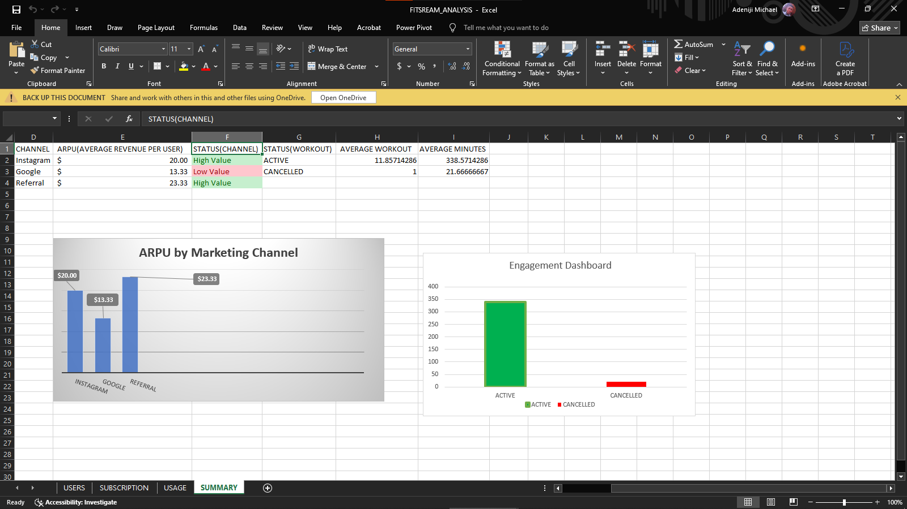
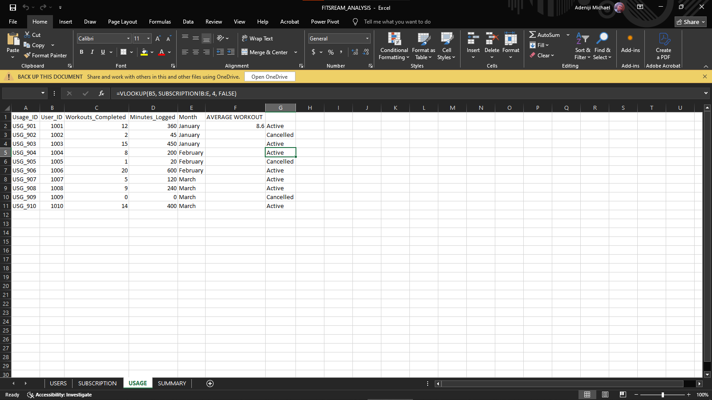
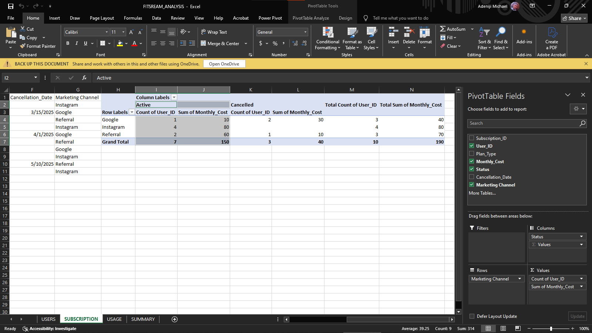

#FitStream: Subscription Churn & Engagement Analysis

##  Project Objective
This project analyzes subscriber behavior for FitStream. By merging subscription data with user activity logs, I identified the key drivers of churn and calculated the ROI of different marketing channels.

##  Executive Dashboard

*Note: This dashboard identifies a 27% churn rate and reveals that Referrals provide the highest ARPU ($23.33).*

##  Technical Skills Demonstrated

### 1. Data Relational Mapping & Logic

* Used `VLOOKUP` and `IFERROR` to join three datasets (Users, Subscriptions, and Usage) into a master analytical sheet.

### 2. Pivot Table Aggregation

* Built Pivot Tables to segment revenue and user counts by Marketing Channel and Status.

##  Key Insights
* **The Churn "Smoking Gun":** Cancelled users average only 1 workout/month compared to ~12 for active users.
* **Channel Efficiency:** While Instagram has the most users, **Referral** users are the most valuable with an ARPU of $23.33.

##  Business Recommendations
* **Budget Shift:** Reallocate marketing spend from Google to Referral programs.
* **Retention Trigger:** Launch re-engagement campaigns for users who log <3 workouts in their first week.
